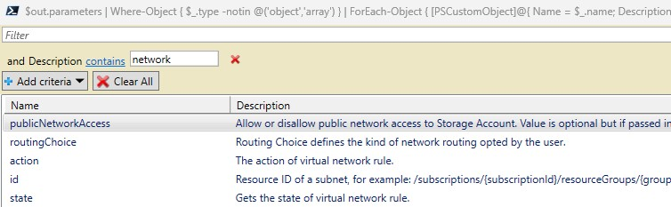

# REST to CARML

This module provides you with the ability to fetch data for the API specs by providing it with the desired Provider-Namespace / Resource-Type combination.

> Note: As this utility is strongly tight to the REST2CARML workstream of the [CARML](https://aka.ms/CARML) repository, the utility returns additional information you may not find useful (for example, the file content for a module's RBAC deployment).

### _Navigation_

- [Usage](#usage)
- [In-scope](#in-scope)
- [Out-of-scope](#out-of-scope)

---

## Usage
- Import the module using the command `Import-Module './utilities/tools/AzureApiCrawler/AzureApiCrawler.psm1' -Force -Verbose`
- Invoke its primary function using the command `Get-AzureApiSpecsData -ProviderNamespace '<ProviderNamespace>' -ResourceType '<ResourceType>' -Verbose -KeepArtifacts`
- For repeated runs it is recommended to append the `-KeepArtifacts` parameter as the function will otherwise repeatably download & eventually delete the required documentation
- Process the output
  At the time of this writing, the output structure is not yet decided. To this end, the function will return a flat list of all parameters with all their data. The following examples may give you some inspiration what you can do with that output:
  ```PowerShell
  # Get the Storage Account resource data (and the one of all its child-resources)
  $out = Get-AzureApiSpecsData -ProviderNamespace 'Microsoft.Storage' -ResourceType 'storageAccounts' -Verbose -KeepArtifacts

  # The object looks somewhat like:
  # Name                           Value
  # ----                           -----
  # data                           {outputs, parameters, resources, variables…}
  # identifier                     Microsoft.Storage/storageAccounts
  # metadata                       {parentUrlPath, urlPath}
  #
  # data                           {outputs, parameters, resources, variables…}
  # identifier                     Microsoft.Storage/storageAccounts/localUsers
  # metadata                       {parentUrlPath, urlPath}

  # Filter the list down to only the Storage Account itself
  $storageAccountResource = $out | Where-Object { $_.identifier -eq 'Microsoft.Storage/storageAccounts' }

  # Print a simple outline similar to the Azure Resource reference:
  $storageAccountResource.data.parameters | ForEach-Object { '{0}{1}:{2}' -f ('  ' * $_.level), $_.name, $_.type  } 
  # Returns:
  # --------
  # name:string
  # extendedLocation:object
  #   type:string
  #   name:string
  # identity:object
  #   type:string
  #   userAssignedIdentities:object
  # kind:string
  # properties:object
  #   keyPolicy:object
  #   (...)

  # Filter parameters down to those containing the keyword 'network' 
  $storageAccountResource.data.parameters | Where-Object { $_.description -like "*network*" } | ConvertTo-Json
  # Returns:
  # --------
  # [
  #   {
  #     "level": 1,
  #     "type": "string",
  #     "allowedValues": [
  #       "Enabled",
  #       "Disabled"
  #     ],
  #     "name": "publicNetworkAccess",
  #     "required": false,
  #     "description": "Allow or disallow public network access to Storage Account. Value is optional but if passed in, must be 'Enabled' or 'Disabled'.",
  #     "Parent": "properties"
  #   },
  #   {
  #     "level": 1,
  #     "type": "object",
  #     "name": "routingPreference",
  #     "required": false,
  #     "description": "Routing preference defines the type of network, either microsoft or internet routing to be used to deliver the user data, the default option is microsoft routing",
  #     "Parent": "properties"
  #   },
  #   (...)
  # ]

  # Use the Grid-View to enable dynamic UI processing using a table format
  $storageAccountResource.data.parameters | Where-Object { $_.type -notin @('object','array') } | ForEach-Object { [PSCustomObject]@{ Name = $_.name; Description = $_.description  }  } | Out-GridView

  # Get data for a specific child-resource type
  $out = Get-AzureApiSpecsData -ProviderNamespace 'Microsoft.Storage' -ResourceType 'storageAccounts/blobServices/containers' -Verbose -KeepArtifacts

  # Additional evaluation
  ## Supports Locks
  $out | Foreach-Object { 
    [PSCustomObject]@{
      Name         = $_.identifier
      'Supports Lock' = $_.data.additionalParameters.name -contains 'lock' 
    }
  } | Sort-Object -Property 'Name'
  # Returns:
  # --------
  # Name                                                                           Supports Lock
  # ----                                                                           -------------
  # Microsoft.Storage/storageAccounts/blobServices/containers                              False
  # Microsoft.Storage/storageAccounts/blobServices/containers/immutabilityPolicies         False

  ## Supports Private Endpoints
  $out | Foreach-Object { 
    [PSCustomObject]@{
      Name = $_.identifier
      'Supports Private Endpoints' = $_.data.additionalParameters.name -contains 'privateEndpoints' 
    }
  } | Sort-Object -Property 'Name'
  # Returns:
  # --------
  # Name                                                                           Supports Private Endpoints
  # ----                                                                           --------------------------
  # Microsoft.Storage/storageAccounts/blobServices/containers                                           False
  # Microsoft.Storage/storageAccounts/blobServices/containers/immutabilityPolicies                      False

  ## Supports Diagnostic Settings
  $out | Foreach-Object { 
    [PSCustomObject]@{
      Name = $_.identifier
      'Supports Diagnostic Settings' = $_.data.additionalParameters.name -contains 'diagnosticWorkspaceId' 
    }
  } | Sort-Object -Property 'Name'
  # Returns:
  # --------
  # Name                                                                           Supports Diagnostic Settings
  # ----                                                                           ----------------------------
  # Microsoft.Storage/storageAccounts/blobServices/containers                                             False
  # Microsoft.Storage/storageAccounts/blobServices/containers/immutabilityPolicies                        False

  ## Supports RBAC
  $out | Foreach-Object { 
    [PSCustomObject]@{
      Name = $_.identifier
      'Supports Role Assignments' = $_.data.additionalParameters.name -contains 'roleAssignments' 
    }
  } | Sort-Object -Property 'Name'
  # Returns:
  # --------
  # Name                                                                           Supports Role Assignments
  # ----                                                                           -------------------------
  # Microsoft.Storage/storageAccounts/blobServices/containers                                           True
  # Microsoft.Storage/storageAccounts/blobServices/containers/immutabilityPolicies                      True

  ## Supported RBAC Roles
  (($out | Where-Object { 
    $_.identifier -eq 'Microsoft.Storage/storageAccounts/blobServices/containers' 
  }).data.additionalFiles | Where-Object { 
    $_.type -eq 'roleAssignments' 
  }).onlyRoleDefinitionNames
  # Returns:
  # --------
  # Avere Contributor
  # Avere Contributor
  # Avere Operator
  # Avere Operator
  # Backup Contributor
  # Backup Operator
  # Contributor
  # Desktop Virtualization Virtual Machine Contributor
  ```
  
 

# In scope

- Fetch data for the resource type with parameters
- Fetch data for child resources
- Extension resources like RBAC, Private Endpoints, etc.?

# Known issues

## Diagnostic Settings
The data source for Diagnostic Logs & Metrics is not 100% reliable

## Locks
The data source for Locks is not 100% reliable. Currently it is assumed that all top-level resources besides those in the Authorization Namespace support locks

## RBAC
The logic to determine if a resource supports RBAC also includes resources that 'could' have roles (as per their resource type) but actually don't support them